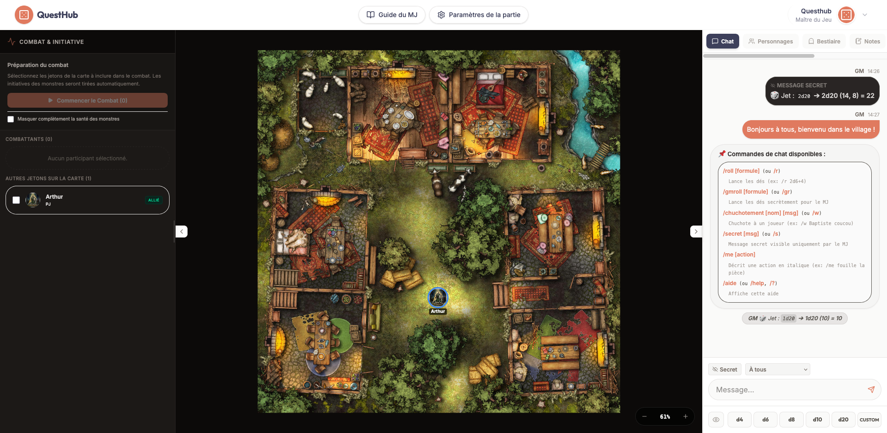
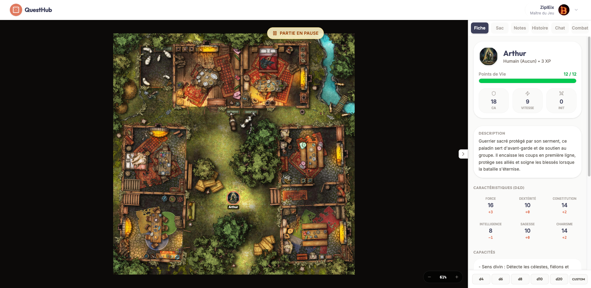

# QuestHub

<p align="center">
  
</p>

QuestHub est une plateforme de jeu de rôle sur table virtuelle (Virtual Tabletop ou VTT) et un compagnon de campagne moderne, gratuit et open-source.

👉 **Découvrez le site en direct : [questhub.fr](https://questhub.fr)**

Conçu pour être simple, fluide et immersif, QuestHub vous permet d'organiser vos parties de jeu de rôle, que vous jouiez **à distance sur internet** ou **en local autour d'une table physique** (en projetant la carte sur une télé ou un mur).

---

## 🌟 Fonctionnalités Principales

*   🗺️ **Plateau de jeu en temps réel (VTT)** : Téléversez vos cartes, placez-y la grille de combat et déplacez vos jetons de personnages et de monstres. Les mouvements et les pings s'affichent instantanément sur les écrans de tous les joueurs.
*   🖥️ **Mode Présentation (Idéal pour le jeu en local / IRL)** : Vous jouez tous dans la même pièce ? Lancez le mode Présentation dans un nouvel onglet, déplacez-le sur votre téléviseur ou projecteur, et affichez uniquement la carte et les jetons visibles par vos joueurs.
*   ⚔️ **Mode Combat & Initiative** : D'un clic, passez en mode combat. Un halo rouge enveloppe l'écran de projection et l'ordre de passage (initiative) s'affiche au-dessus de la carte avec les avatars des combattants. Le tour actif brille d'un contour doré.
*   📖 **Journal de Campagne (Wiki)** : Documentez votre monde, notez vos scénarios et écrivez le résumé de vos sessions dans un éditeur agréable. Organisez vos articles dans des dossiers et liez facilement des images de votre médiathèque.
*   🗂️ **Fiches de Personnages & Bestiaire** : Créez et gérez les fiches de vos héros (statistiques, équipements, points de vie). Le MJ dispose d'un bestiaire complet pour stocker les profils de monstres et de PNJ.
*   🖼️ **Médiathèque partagée (Drive)** : Importez vos illustrations, avatars et cartes. QuestHub s'assure que vos fichiers sont légers et optimisés (formats standardisés, pas de GIF lourds) pour garantir un chargement instantané en cours de partie.
*   🛒 **Marché Communautaire (Marketplace)** : Partagez vos créations (fiches de monstres, modèles de personnages, objets) ou téléchargez les packs de la communauté pour les intégrer instantanément à vos campagnes.

---

## 📸 Aperçu de l'Application

### Tableau de bord du Maître de Jeu (MJ)
Le MJ dispose de tous ses outils sur un même écran : gestion du lore, bestiaire, jetons et configuration du plateau de jeu.


### Vue Joueur (Plateau de jeu & Immersion)
Une interface épurée concentrée sur la carte, le chat, la feuille de personnage et les lancers de dés.


---

## 🛠️ Pour les curieux (Stack Technique)

QuestHub est conçu avec des technologies ultra-modernes pour garantir une réactivité et une légèreté maximales :

*   **Interface (Frontend)** : [SvelteKit](https://kit.svelte.dev/) (avec Svelte 5) pour une rapidité d'affichage incomparable, stylisé avec [TailwindCSS v4](https://tailwindcss.com/).
*   **Base de données & Temps réel (Backend)** : [Supabase](https://supabase.com/) (PostgreSQL) gérant l'authentification (E-mail + Google), le stockage d'images sécurisé et la synchronisation en temps réel (canaux WebSocket).
*   **Moteur d'exécution** : [Bun](https://bun.sh/) pour le développement et la compilation ultra-rapide.

---

## 🚀 Comment l'installer localement (Développeurs)

### Prérequis
*   [Bun](https://bun.sh/) ou Node.js installé sur votre machine.
*   Un projet [Supabase](https://supabase.com/) actif.

### Installation

1.  **Cloner le projet**
    ```bash
    git clone https://github.com/yourusername/questhub.git
    cd questhub
    ```

2.  **Lier votre projet Supabase**
    ```bash
    bunx supabase link --project-ref <votre-identifiant-projet>
    ```

3.  **Appliquer le schéma de base de données**
    Déployez les tables, fonctions SQL, politiques d'accès (RLS) et configurations de temps réel :
    ```bash
    bunx supabase db push
    ```

4.  **Configurer les variables d'environnement**
    Créez un fichier `.env` à la racine :
    ```env
    PUBLIC_SUPABASE_URL=https://<votre-identifiant-projet>.supabase.co
    PUBLIC_SUPABASE_ANON_KEY=<votre-cle-anonyme-anon>
    ```

5.  **Installer les dépendances et lancer**
    ```bash
    bun install
    bun run dev
    ```
    Ouvrez votre navigateur sur `http://localhost:5173`.

---

## 🤝 Contribuer & Licence

Les contributions sont les bienvenues ! N'hésitez pas à ouvrir un rapport d'anomalie ou à soumettre une proposition de modification (Pull Request).

Distribué sous licence MIT. Voir `LICENSE` pour plus d'informations.
